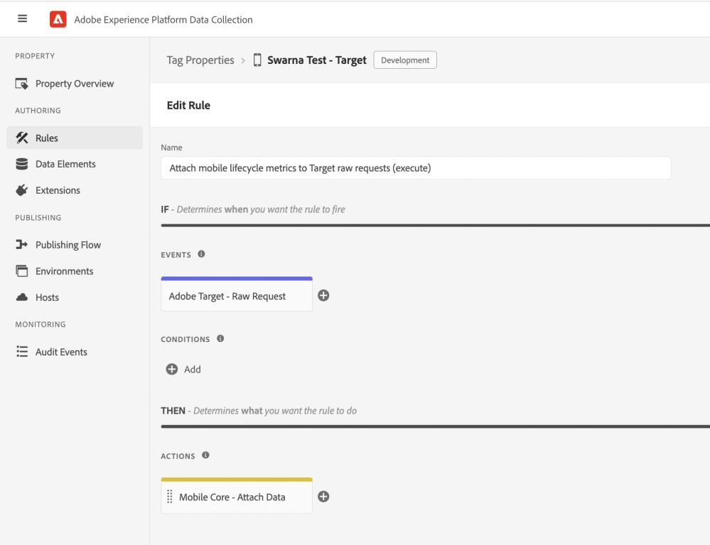
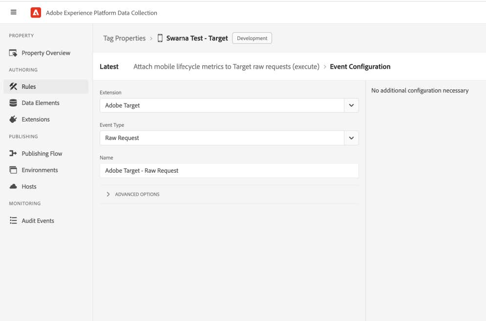
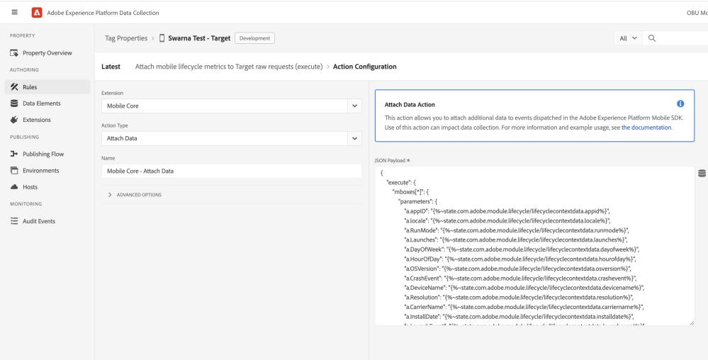

#  Attach mobile lifecycle metrics to Target requests when using raw APIs

Sending mobile lifecycle data, as mbox parameters, to Adobe Target enables audience segmentation based on these metrics. To send these metrics to Target for creating audiences, a rule needs to be set up on Experience Platform Data Collection UI to attach these metrics to the Target content or notifications requests. Follow the link to learn [how to target visitors using Custom Parameters in Adobe Target](https://experienceleague.adobe.com/docs/target/using/audiences/create-audiences/categories-audiences/custom-parameters.html?lang=en).

**Create a rule**

On Experience Platform Data Collection, navigate to Data Collection > Tags using the left navigation panel. Select an existing mobile tag property or create a new property.
1. In your mobile property, navigate to Rules in the left navigation panel and click on Create New Rule. If there already are existing rules, you can click on Add Rule to add a new rule.
2. Provide a name for your rule. In the example here, the rule is named " Attach mobile lifecycle metrics to Target raw requests (execute)".



**Select an event**

1. Under the Events section, click on Add.
2. From the Extension dropdown list, select Adobe Target.
3. From the Event Type dropdown list, select Raw Request.
4. Click on Keep Changes.



** Define the action **

1. Under the Actions section, click on Add.
2. From the Extension dropdown list, select Mobile Core.
3. From the Action Type dropdown list, select Attach Data.
4. On the right pane, specify the JSON Payload containing metrics of interest.

Attach data JSON for raw execute request

```json
{
    "execute":{
        "mboxes[*]":{
            "parameters":{
                "a.appID":"",
                "a.locale":"",
                "a.RunMode":"",
                "a.Launches":"",
                "a.DayOfWeek":"",
                "a.HourOfDay":"",
                "a.OSVersion":"",
                "a.CrashEvent":"",
                "a.DeviceName":"",
                "a.Resolution":"",
                "a.CarrierName":"",
                "a.InstallDate":"",
                "a.LaunchEvent":"",
                "a.InstallEvent":"",
                "a.UpgradeEvent":"",
                "a.DaysSinceLastUse":"",
                "a.DailyEngUserEvent":"",
                "a.DaysSinceFirstUse":"",
                "a.PrevSessionLength":"",
                "a.MonthlyEngUserEvent":"",
                "a.DaysSinceLastUpgrade":"",
                "a.LaunchesSinceUpgrade":"",
                "a.ignoredSessionLength":""
            }
        }
    }
}
```

Attach data JSON for raw prefetch request

```json
{
"prefetch":{
    "mboxes[*]":{
        "parameters":{
                "a.appID":"",
                "a.locale":"",
                "a.RunMode":"",
                "a.Launches":"",
                "a.DayOfWeek":"",
                "a.HourOfDay":"",
                "a.OSVersion":"",
                "a.CrashEvent":"",
                "a.DeviceName":"",
                "a.Resolution":"",
                "a.CarrierName":"",
                "a.InstallDate":"",
                "a.LaunchEvent":"",
                "a.InstallEvent":"",
                "a.UpgradeEvent":"",
                "a.DaysSinceLastUse":"",
                "a.DailyEngUserEvent":"",
                "a.DaysSinceFirstUse":"",
                "a.PrevSessionLength":"",
                "a.MonthlyEngUserEvent":"",
                "a.DaysSinceLastUpgrade":"",
                "a.LaunchesSinceUpgrade":"",
                "a.ignoredSessionLength":""
            }
        }
    }
}
```

Attach data JSON for notification requests

```json
{
"notifications[*]": {
    "parameters": {
            "a.appID": "",
            "a.locale": "",
            "a.RunMode": "",
            "a.Launches": "",
            "a.DayOfWeek": "",
            "a.HourOfDay": "",
            "a.OSVersion": "",
            "a.CrashEvent": "",
            "a.DeviceName": "",
            "a.Resolution": "",
            "a.CarrierName": "",
            "a.InstallDate": "",
            "a.LaunchEvent": "",
            "a.InstallEvent": "",
            "a.UpgradeEvent": "",
            "a.DaysSinceLastUse": "",
            "a.DailyEngUserEvent": "",
            "a.DaysSinceFirstUse": "",
            "a.PrevSessionLength": "",
            "a.MonthlyEngUserEvent": "",
            "a.DaysSinceLastUpgrade": "",
            "a.LaunchesSinceUpgrade": "",
            "a.ignoredSessionLength": ""
        }
    }
}
```

5. Click on Keep Changes.



**Save the rule and republish the configuration**

After you finish your rule configuration:
1. Click on Save.
2. [Republish your configuration](https://developer.adobe.com/client-sdks/documentation/getting-started/create-a-mobile-property/#publish-the-configuration) to the desired environment.
