# Adobe Target remote property token updates

## Non-unique mboxes support in batch requests

We have introduced two new raw APIs – [executeRawRequest](./api-reference.md#executeRawRequest) and [sendRawNotifications](./api-reference.md#sendRawNotifications) - in the Target SDK to support execute and prefetch requests for non-unique mbox locations. When using these APIs, please be aware of the following details:
* SDK will accept the API request data dictionary (or Map) in the v1 delivery API request format and it will return the full Target v1 delivery response if the request is successful.
* SDK will not send out-of-the-box A4T hits to Adobe Analytics. The Analytics payload (and clickconversion Analytics payload) can be retrieved from the executeRawRequest API response for execute or prefetch, if needed.
* SDK will not auto-attach mobile lifecycle metrics to the mbox parameters in the API requests, though this can be achieved via remote rules. See [Attach lifecycle metrics to Target requests when using raw APIs](./attach-lifecycle-metrics-to-Target-requests.md)
* SDK will accept the specified root objects in the API request – id, environmentId, property,  context , experienceCloud, execute or prefetch, and notifications. If provided, these objects should be provided in entirety as SDK will not augment any partial objects. If not provided, SDK will auto-populate and attach id, environmentId, context, property, and experienceCloud to all outgoing Target requests. The environmentId and property token will contain the values configured in the Data Collection UI extension for Target.
* SDK will give preference to property token and environmentId values configured in the Target extension on Experience Platform Data Collection UI, as opposed to those provided in the API request. If it is desired to provide these values per request, please do not configure these values in the Target extension on Data Collection UI.

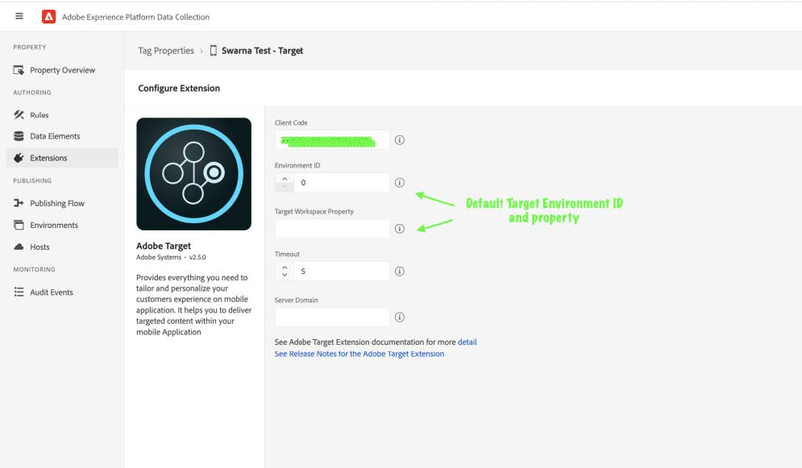

> **Note**
> These raw APIs do not leverage the SDK caching mechanism used by regular Target APIs for prefetch, execute and notifications. So, it is recommended to not use the regular and raw APIs in mixand-match mode to avoid erroneous results. See 

## Remote property token updates when using Raw Target APIs

A new Target event `Raw Request` is added for the Adobe Target extension on Data Collection UI, to support creation of rules for remote property token updates when using the raw Target APIs. See [Upgrade Adobe Target extension on Data Collection](./update-target-extension-data-collection.md)

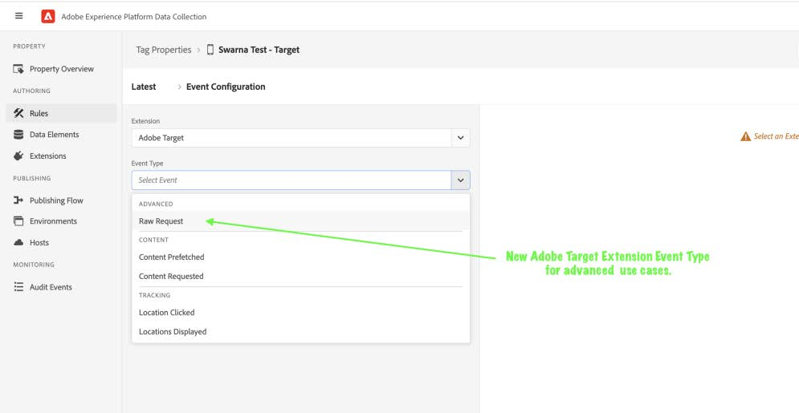

### Attach Target property token to execute/prefetch or notification raw requests

Rules can be set up on the Data Collection UI to attach Target property token to raw prefetch or execute and notification requests.

**Create a rule**

On Experience Platform Data Collection, navigate to Data Collection > Tags using the left navigation panel. Select an existing mobile tag property or create a new property.
1. In your mobile property, navigate to Rules in the left navigation panel and click on Create New Rule. If there already are existing rules, you can click on Add Rule to add a new rule.
2. Provide a name for your rule. In the example here, the rule is named "Attach property token to Target raw requests".


**Select an event**

1. Under the Events section, click on Add. 
2. From the Extension dropdown list, select Adobe Target.
3. From the Event Type dropdown list, select Raw Request.
4. Click on Keep Changes.

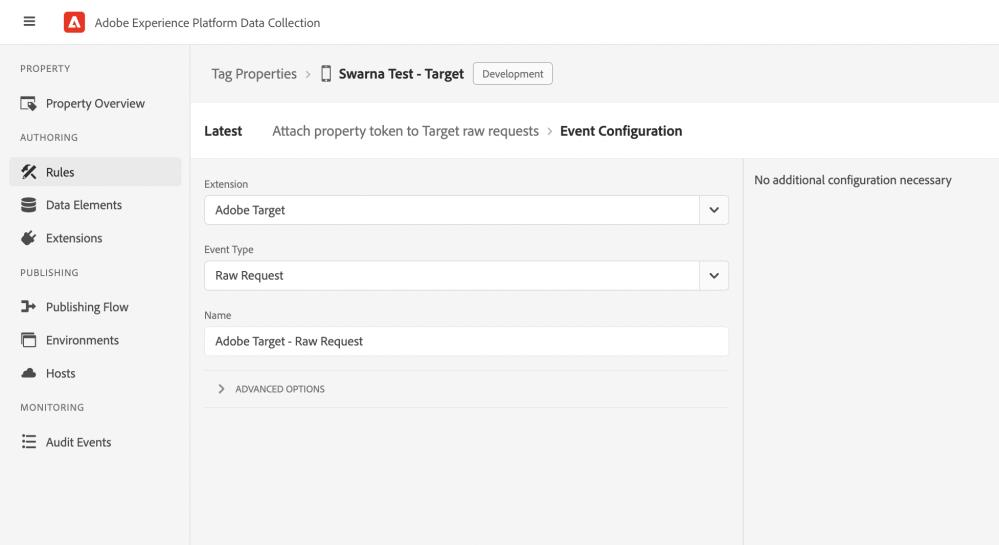

**Define the action**

1. Under the Actions section, click on Add.
2. From the Extension dropdown list, select Mobile Core.
3. From the Action Type dropdown list, select Attach Data. You may use the Action Type as Modify Data, if the property object is already being provided in the request to executeRawRequest API call and you want to modify the value remotely. (Attach Data action type will not update an already existing value in the Event’s data)
4. On the right pane, specify the JSON Payload.

```json
{
    "property": {
        "token": "2e29d1d4-2c18-7cd4-3df4-871b53dfa158"
    }
}
```

5. Click on Keep Changes.

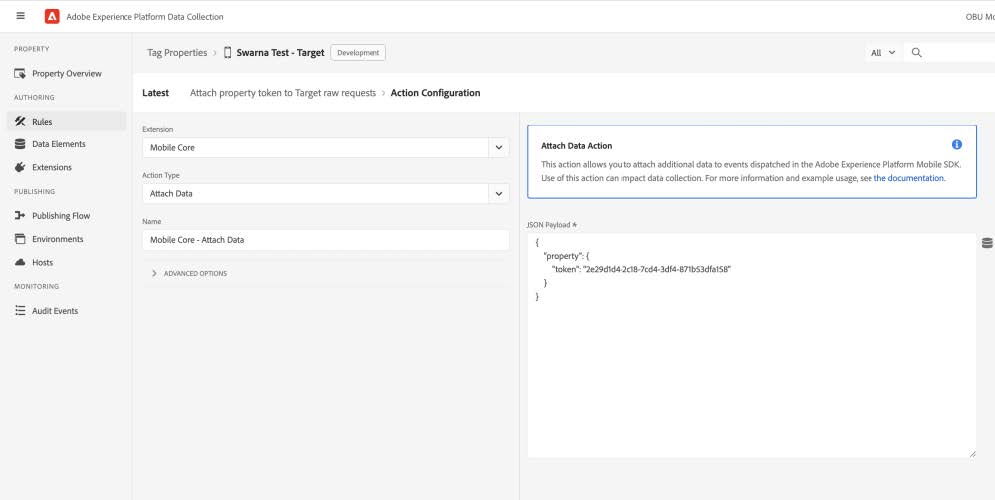

**Save the rule and republish the configuration**

After you finish your rule configuration:
1. Click on Save.
2. [Republish your configuration](https://developer.adobe.com/client-sdks/documentation/getting-started/create-a-mobile-property/#publish-the-configuration) to the desired environment.

## Remote property token updates when using Regular Target APIs

### Attach Target property token to prefetch requests

Rules can be set up on the Data Collection UI to attach Target property token to regular prefetch requests (prefetchContent API).

**Create a rule**

On Experience Platform Data Collection, navigate to Data Collection > Tags using the left navigation panel. Select an existing mobile tag property or create a new property.
1. In your mobile property, navigate to Rules in the left navigation panel and click on Create New Rule. If there already are existing rules, you can click on Add Rule to add a new rule.
2. Provide a name for your rule. In the example here, the rule is named "Attach property token to Target prefetch requests".

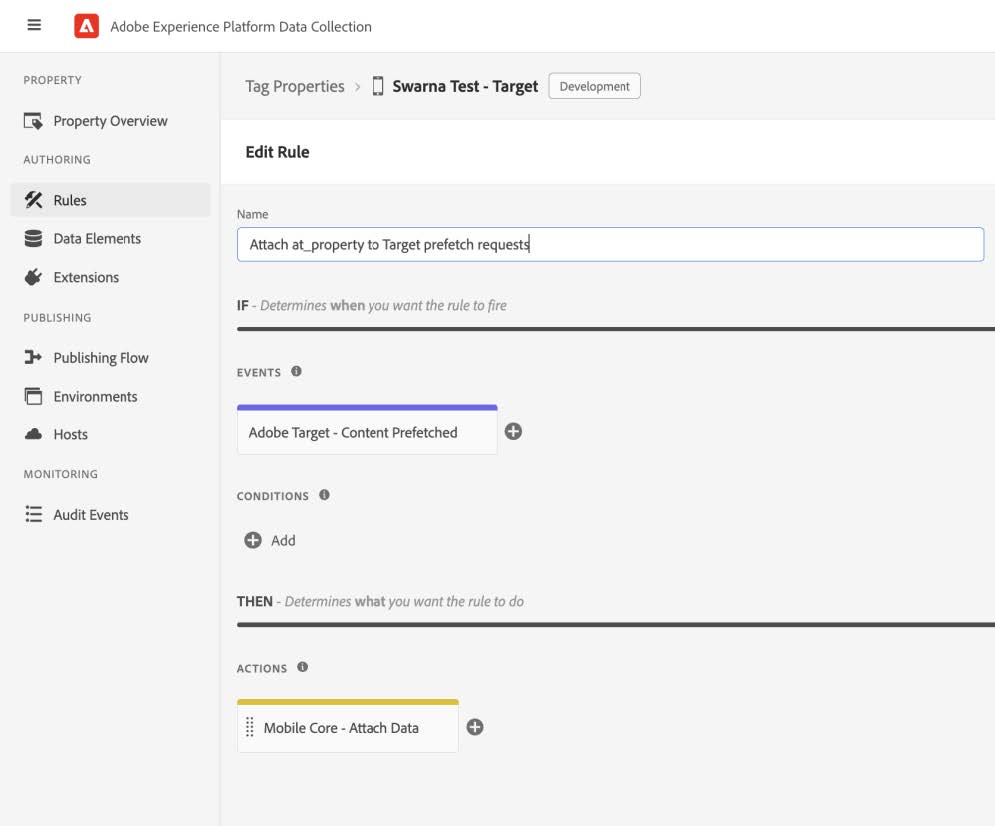

**Select an event**

1. Under the Events section, click on Add.
2. From the Extension dropdown list, select Adobe Target.
3. From the Event Type dropdown list, select Content Prefetched.
4. Click on Keep Changes.


**Define the action**

1. Under the Actions section, click on Add.
2. From the Extension dropdown list, select Mobile Core.
3. From the Action Type dropdown list, select Attach Data.
4. On the right pane, specify the JSON Payload.

```json
{
    "at_property": "ccc7cdb3-c67a-6126-10b3-65d7f4d32b69",
    "targetparams": {
        "mboxparameters": {
            "at_property": "2e29d1d4-2c18-7cd4-3df4-871b53dfa158"
        }
    }
}
```

5. Click on Keep Changes.
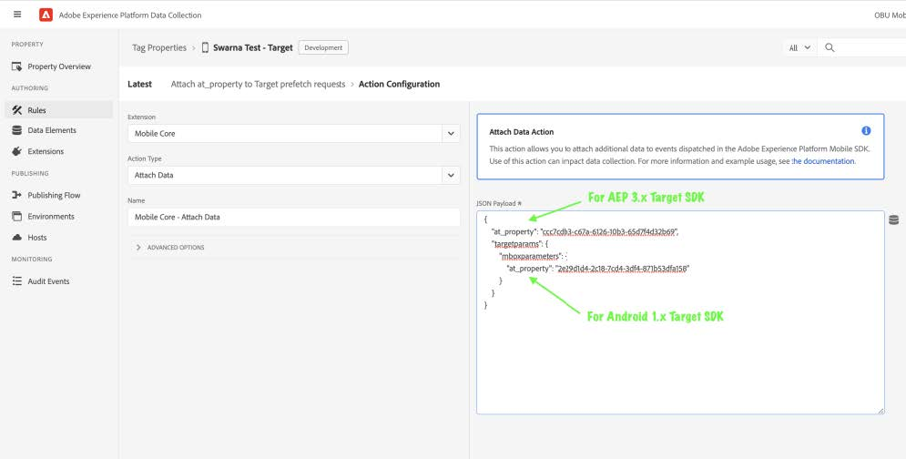

**Save the rule and republish the configuration**

After you finish your rule configuration:
1. Click on Save.
2. [Republish your configuration](https://developer.adobe.com/client-sdks/documentation/getting-started/create-a-mobile-property/#publish-the-configuration) to the desired environment.

### Attach Target property token to execute requests

Rules can be set up on the Data Collection UI to attach Target property token to regular prefetch requests (retrieveLocationContent API).

**Create a rule**

On Experience Platform Data Collection, navigate to Data Collection > Tags using the left navigation panel. Select an existing mobile tag property or create a new property.
1. In your mobile property, navigate to Rules in the left navigation panel and click on Create New Rule. If there already are existing rules, you can click on Add Rule to add a new rule.
2. Provide a name for your rule. In the example here, the rule is named "Attach property token to Target execute requests ".

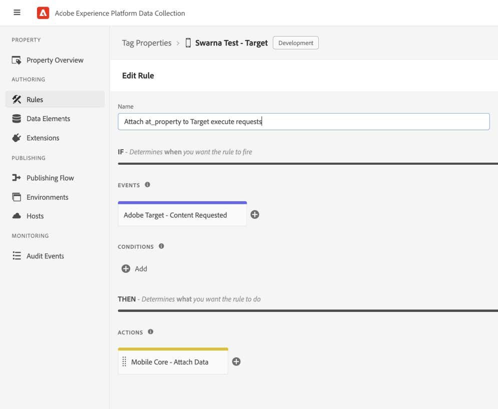

**Select an event**

1. Under the Events section, click on Add.
2. From the Extension dropdown list, select Adobe Target.
3. From the Event Type dropdown list, select Content Requested.
4. Click on Keep Changes.

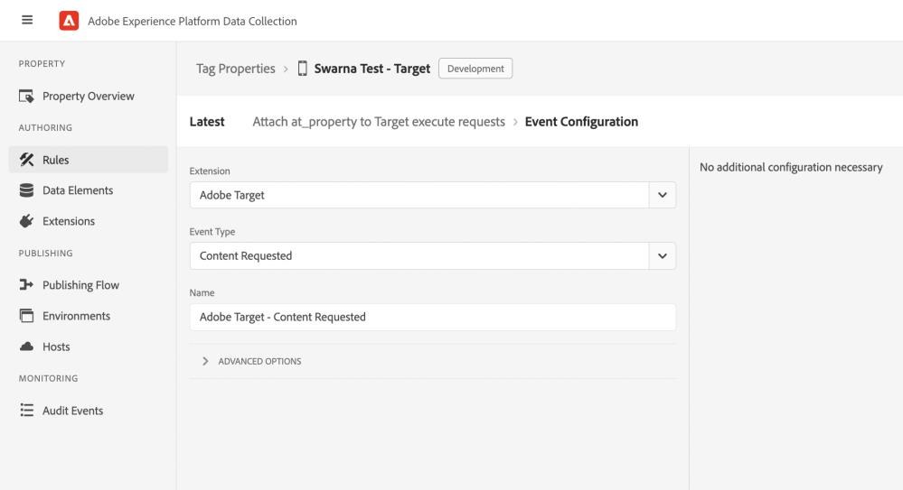

**Define the action**

6. Under the Actions section, click on Add.
7. From the Extension dropdown list, select Mobile Core.
8. From the Action Type dropdown list, select Attach Data.
9. On the right pane, specify the JSON Payload.

```json
{
    "at_property": "ccc7cdb3-c67a-6126-10b3-65d7f4d32b69",
    "targetparams": {
        "mboxparameters": {
            "at_property": "2e29d1d4-2c18-7cd4-3df4-871b53dfa158"
        }
    }
}
```

10. Click on Keep Changes.

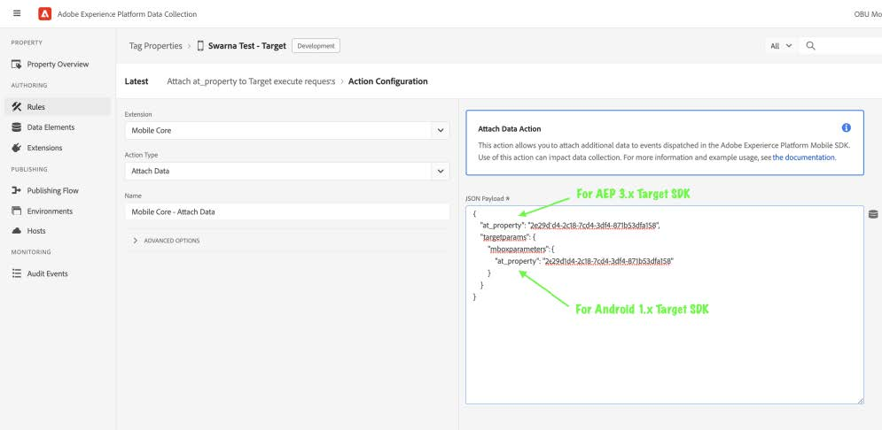

**Save the rule and republish the configuration**

After you finish your rule configuration:
1. Click on Save.
2. [Republish your configuration](https://developer.adobe.com/client-sdks/documentation/getting-started/create-a-mobile-property/#publish-the-configuration) to the desired environment.

### Attach Target property token to display notification requests

Rules can be set up on the Data Collection UI to attach Target property token to regular prefetch requests (displayedLocations API).
Create a rule
On Experience Platform Data Collection, navigate to Data Collection > Tags using the left navigation panel. Select an existing mobile tag property or create a new property.
1. In your mobile property, navigate to Rules in the left navigation panel and click on Create New Rule. If there already are existing rules, you can click on Add Rule to add a new rule.
2. Provide a name for your rule. In the example here, the rule is named "Attach property token to Target display notification".

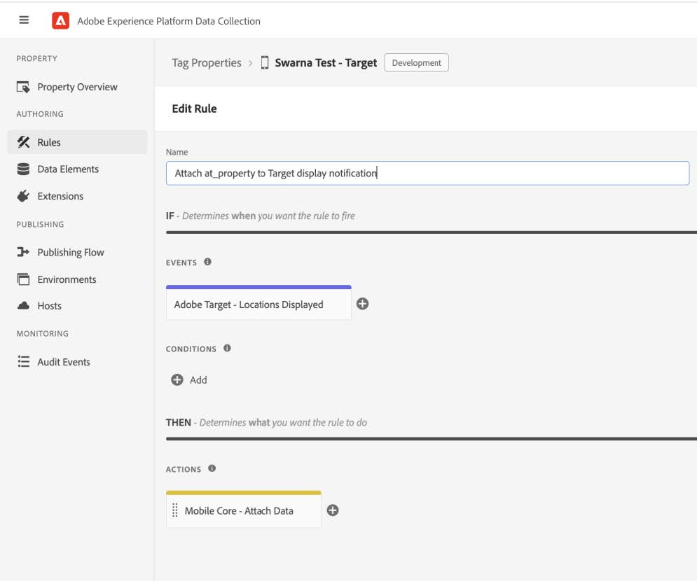

**Select an event**

1. Under the Events section, click on Add.
2. From the Extension dropdown list, select Adobe Target.
3. From the Event Type dropdown list, select Locations Displayed.
4. Click on Keep Changes.


**Define the action**

1. Under the Actions section, click on Add.
2. From the Extension dropdown list, select Mobile Core.
3. From the Action Type dropdown list, select Attach Data.
4. On the right pane, specify the JSON Payload.

```json
{
    "at_property": "ccc7cdb3-c67a-6126-10b3-65d7f4d32b69",
    "targetparams": {
        "mboxparameters": {
            "at_property": "2e29d1d4-2c18-7cd4-3df4-871b53dfa158"
        }
    }
}
```
5. Click on Keep Changes.

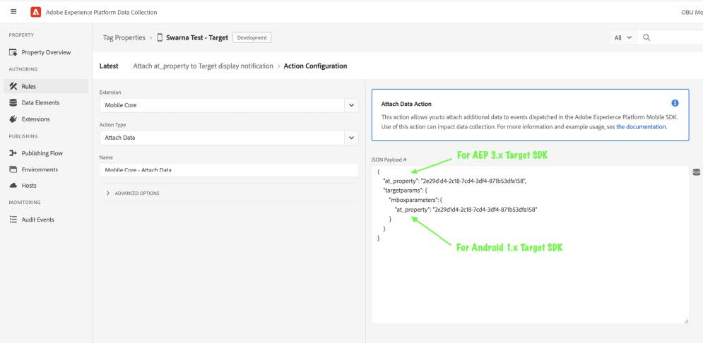

**Save the rule and republish the configuration**

After you finish your rule configuration:
1. Click on Save.
2. [Republish your configuration](https://developer.adobe.com/client-sdks/documentation/getting-started/create-a-mobile-property/#publish-the-configuration) to the desired environment.

### Attach Target property token to click notification requests

Rules can be set up on the Data Collection UI to attach Target property token to regular prefetch requests (clickedLocation API).

**Create a rule**

On Experience Platform Data Collection, navigate to Data Collection > Tags using the left navigation panel. Select an existing mobile tag property or create a new property.
1. In your mobile property, navigate to Rules in the left navigation panel and click on Create New Rule. If there already are existing rules, you can click on Add Rule to add a new rule.
2. Provide a name for your rule. In the example here, the rule is named " Attach property token to Target click notification".

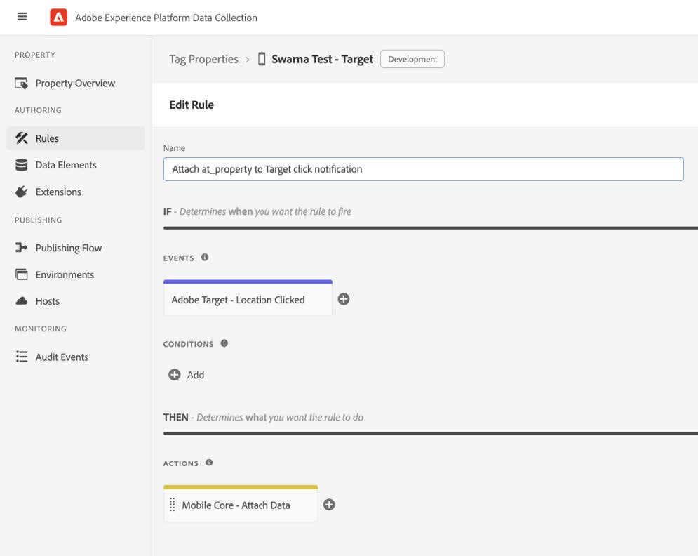

**Select an event**

1. Under the Events section, click on Add.
2. From the Extension dropdown list, select Adobe Target.
3. From the Event Type dropdown list, select Location Clicked.
4. Click on Keep Changes.

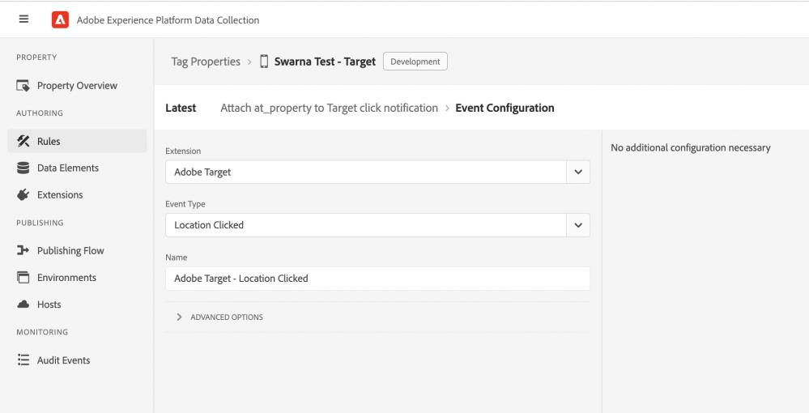

**Define the action**

1. Under the Actions section, click on Add.
2. From the Extension dropdown list, select Mobile Core.
3. From the Action Type dropdown list, select Attach Data.
4. On the right pane, specify the JSON Payload.

```json
{
"at_property": "ccc7cdb3-c67a-6126-10b3-65d7f4d32b69",
    "targetparams": {
    "mboxparameters": {
            "at_property": "2e29d1d4-2c18-7cd4-3df4-871b53dfa158"
        }
    }
}
```

5. Click on Keep Changes.

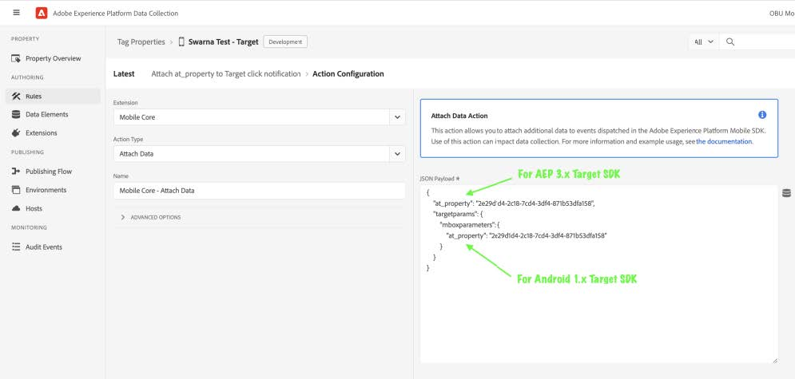

**Save the rule and republish the configuration**

After you finish your rule configuration:
1. Click on Save.
2. [Republish your configuration](https://developer.adobe.com/client-sdks/documentation/getting-started/create-a-mobile-property/#publish-the-configuration) to the desired environment.
