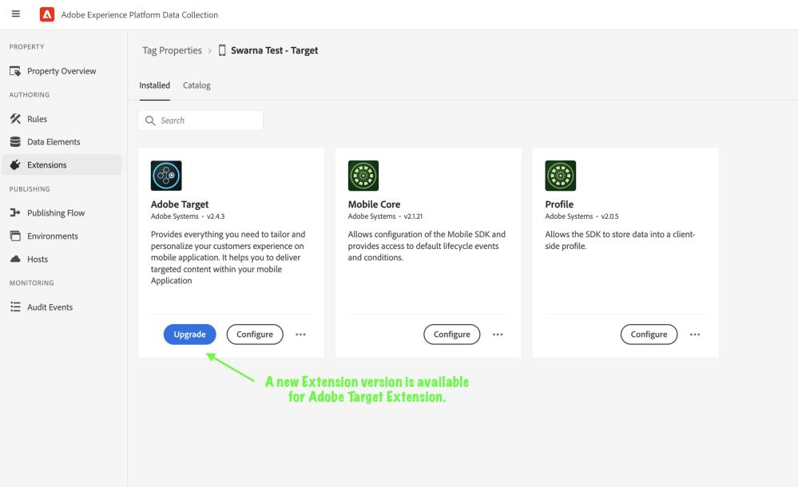
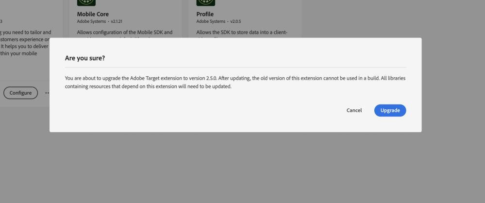
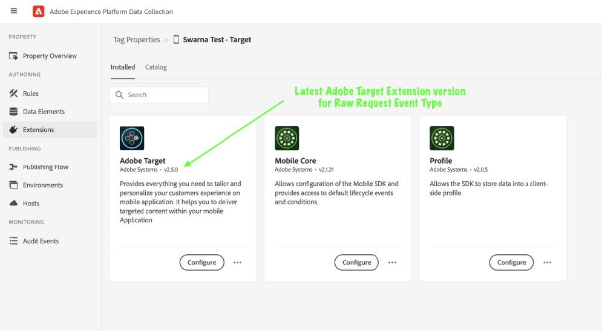

# Upgrade Target extension on Data Collection UI

Target extension v2.5.0 and above on Data Collection UI supports the `Raw Request` Event Type for Adobe Target extension. Click Upgrade to install the new extension version and then [publish the configuration.](https://developer.adobe.com/client-sdks/documentation/getting-started/create-a-mobile-property/#publish-the-configuration)

